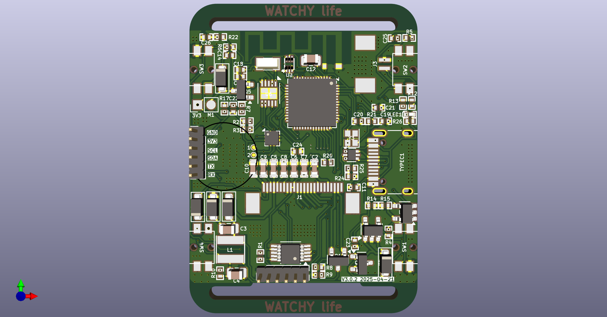

# watchy-hardware-v3  

<a href="https://github.com/sqfmi/watchy-hardware/tree/v3.0">Watchy Hardware V3</a> has only released schematics and is not fully open-source, nor are there plans to fully open-source it.  

This project is based on the schematic, with the following additions/modifications:  
- Replace the Micro USB port with a Type-C interface
- Added an auto-download serial chip (CH340x)  
- Added some debug interfaces
- Retained the v2.0 RTC chip (PCF8536)  

  

If you want it to match the official v3.0 exactly, you can omit soldering:  
- The CH340x  
- The PCF8536  
- The 40MHz crystal (the official schematic includes it, but it’s actually not used)

# 中文

<a href="https://github.com/sqfmi/watchy-hardware/tree/v3.0">Watchy Hardware V3</a> 只发布了原理图, 并没有完全开源, 也没有完全开源的计划. 

本项目依据该原理图, 替换了Micro usb为Typec, 增加了自动下载串口CH340x, 增加了调试接口, 保留了2.0 RTC芯片PCF8536.

如想与官方3.0一致, 可不焊接CH340x, PCF8536, 和40M晶振(官方原理图需要有, 但其实没用到40M晶振)